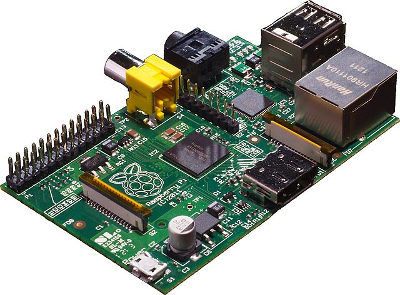

# Linux Bohai - Season 1 [](https://travis-ci.org/metasepi/linux-bohai-s1/)

## Hardware specification

[](http://www.raspberrypi.org/)

* Board name: [Raspberry Pi](http://www.raspberrypi.org/)
* SoC: Broadcom [BCM2835](http://www.broadcom.com/products/BCM2835) (CPU, GPU, DSP, SDRAM, and single USB port)
* CPU: 700 MHz [ARM1176JZF-S](http://www.arm.com/products/processors/classic/arm11/arm1176.php) core ([ARM11](http://en.wikipedia.org/wiki/ARM11) family, ARMv6 instruction set)
* GPU: Broadcom [VideoCore IV](http://www.broadcom.com/products/technology/mobmm_videocore.php) @ 250 MHz
* Memory: 256 MB or 512 MB

## How to build

First, get your own [Debian](https://www.debian.org/) PC.

Install [ATS2](http://www.ats-lang.org/).

```
$ cd ${HOME}
$ sudo apt-get install libgc-dev libgmp-dev make bc
$ git clone https://github.com/githwxi/ATS-Postiats-contrib.git
$ export PATSHOMERELOC=${HOME}/ATS-Postiats-contrib
$ git clone git://git.code.sf.net/p/ats2-lang/code ATS2-srcfrg
$ export PATSHOME=${HOME}/ATS2-srcfrg
$ export PATH=${PATH}:${PATSHOME}/bin
$ cd ${PATSHOME} && ./configure && make
```

Install ARM cross toolchain.

```
$ git clone https://github.com/raspberrypi/tools.git
$ export RASPI_PREFIX=`pwd`/tools/arm-bcm2708/arm-bcm2708hardfp-linux-gnueabi/bin/arm-bcm2708hardfp-linux-gnueabi-
$ ${RASPI_PREFIX}gcc --version | head -1
arm-bcm2708hardfp-linux-gnueabi-gcc (crosstool-NG 1.15.2) 4.7.1 20120402 (prerelease)
```

Build Linux Bohai kernel.

```
$ git clone https://github.com/metasepi/linux-bohai-s1.git
$ cd linux-bohai-s1
$ make
```

## How to install

Write [Raspbian system image](http://www.raspberrypi.org/downloads/) into your SD card, that is connected with your PC.

```
$ wget http://downloads.raspberrypi.org/raspbian_latest
$ unzip -x raspbian_latest
$ sudo dd if=2014-12-24-wheezy-raspbian.img of=/dev/sdb bs=1M
$ sync; sync; sync
```

Write Metasepi kernel into your SD card.

```
$ cd linux-bohai-s1
$ make writesd SDDEV=/dev/sdb
```

Let's boot Metasepi kernel on your Raspberry Pi, while the SD card is inserted into the Raspberry Pi.

## Testing

### Setup test environment on Raspberry Pi

```
$ sudo apt-get install nfs-kernel-server nfs-client shunit2 dbench
$ sudo mkdir -p /var/exports/1
$ sudo chmod 777 /var/exports/1
$ sudo vi /etc/exports
/var/exports/1 localhost(rw,sync,fsid=0,no_root_squash,no_subtree_check)
$ sudo update-rc.d rpcbind enable
$ sudo update-rc.d nfs-common enable
$ sudo /etc/init.d/rpcbind restart
$ sudo /etc/init.d/nfs-common restart
$ sudo /etc/init.d/nfs-kernel-server restart
```

### Run test on Raspberry Pi

```
$ cd /home/pi/TEST
$ make clean
$ make
gcc -w -o bin/fsx-linux src/fsx-linux.c
$ make test
./nfsv2_test.sh
--snip--
truncating to largest ever: 0x3f15f
All operations completed A-OK!
--snip--
 Operation      Count    AvgLat    MaxLat
 ----------------------------------------
 NTCreateX         67   533.636  6506.725
 Close             68  2689.258  8733.454
 Qfileinfo         50   140.895  2494.193
 WriteX           490     1.237    39.597

Throughput 0.737543 MB/sec  5 clients  5 procs  max_latency=8733.536 ms

Ran 3 tests.

OK
```

## How to snatch Linux kernel with ATS2

See following Hongwei comment.

```
If you are reading this message, then you have probably heard or read that ATS
is good for safe systems programming. But you may not have seen low-level systems
code written in ATS, right? There is a reason for this obvious irony for writing such code
in ATS is very challenging. It took us a long time to learn the ropes.

Now I want to write a little bit on how ATS can be used effectively to implement low-level
systems. My focus here is on implementing device drivers for Linux. I will try to follow the
following book:

http://www.tldp.org/LDP/lkmpg/2.6/

The code I use is to be stored at:

https://github.com/githwxi/ATS-Postiats-contrib/tree/master/projects/MEDIUM/LinuxKerneling/

For testing, I suggest that a qemu image be used. I will do a post on it later.
```

## About QEMU issue

* [Compiling an ARM1176 kernel for QEMU (Tutorial) - XEC Design](http://xecdesign.com/compiling-a-kernel/)
* [Raspberry Pi • View topic - HOWTO: Virtual Raspbian on Qemu in Ubuntu Linux 12.10](http://www.raspberrypi.org/forums/viewtopic.php?f=29&t=37386)
* [Raspberry Pi under QEMU | v13 – random words](https://www.v13.gr/blog/?p=276)
* [QEMU - Emulating Raspberry Pi the easy way (Linux or Windows!)](http://xecdesign.com/qemu-emulating-raspberry-pi-the-easy-way/)


## Which compresser is good for raspbian image?

[7-Zip](http://www.7-zip.org/) and [XZ Utils](http://tukaani.org/xz/) are small. However, Zip and gzip are fast.

```
$ ls -l | sort -k 4
total 7404464
-rw-r--r-- 1 kiwamu kiwamu  713745179 Oct 24 08:05 2014-09-09-wheezy-raspbian_7zip.img.7z
-rw-r--r-- 1 kiwamu kiwamu  724729008 Oct 24 07:35 2014-09-09-wheezy-raspbian_xz.img.xz
-rw-r--r-- 1 kiwamu kiwamu  905643360 Oct 24 07:36 2014-09-09-wheezy-raspbian_bzip2.img.bz2
-rw-r--r-- 1 kiwamu kiwamu  978848936 Oct 24 07:33 2014-09-09-wheezy-raspbian.zip
-rw-r--r-- 1 kiwamu kiwamu  982368769 Oct 24 07:36 2014-09-09-wheezy-raspbian_gzip.img.gz
-rw-r--r-- 1 kiwamu kiwamu 3276800000 Sep  9 09:42 2014-09-09-wheezy-raspbian.img
$ rm 2014-09-09-wheezy-raspbian.img
$ vi bench.sh
#!/bin/sh

sync; sync; sync
time unzip -x 2014-09-09-wheezy-raspbian.zip
sync; sync; sync
time 7z e 2014-09-09-wheezy-raspbian_7zip.img.7z
sync; sync; sync
time bunzip2 2014-09-09-wheezy-raspbian_bzip2.img.bz2
sync; sync; sync
time gunzip 2014-09-09-wheezy-raspbian_gzip.img.gz
sync; sync; sync
time unxz 2014-09-09-wheezy-raspbian_xz.img.xz
sync; sync; sync
$ ./bench.sh
Archive:  2014-09-09-wheezy-raspbian.zip
  inflating: 2014-09-09-wheezy-raspbian.img
34.60user 3.36system 0:38.91elapsed 97%CPU (0avgtext+0avgdata 3044maxresident)k
0inputs+6400000outputs (0major+339minor)pagefaults 0swaps

7-Zip [64] 9.20  Copyright (c) 1999-2010 Igor Pavlov  2010-11-18
p7zip Version 9.20 (locale=ja_JP.UTF8,Utf16=on,HugeFiles=on,4 CPUs)

Processing archive: 2014-09-09-wheezy-raspbian_7zip.img.7z

Extracting  2014-09-09-wheezy-raspbian_7zip.img

Everything is Ok

Size:       3276800000
Compressed: 713745179
88.89user 4.26system 1:41.92elapsed 91%CPU (0avgtext+0avgdata 22104maxresident)k
1390144inputs+6400000outputs (0major+4618minor)pagefaults 0swaps
181.08user 6.04system 3:12.61elapsed 97%CPU (0avgtext+0avgdata 4712maxresident)k
1768984inputs+6400000outputs (2major+973minor)pagefaults 0swaps
32.49user 3.76system 0:45.90elapsed 78%CPU (0avgtext+0avgdata 1644maxresident)k
1904416inputs+6400000outputs (2major+158minor)pagefaults 0swaps
82.14user 4.09system 1:28.81elapsed 97%CPU (0avgtext+0avgdata 10412maxresident)k
1402832inputs+4740856outputs (2major+2156minor)pagefaults 0swaps
```

